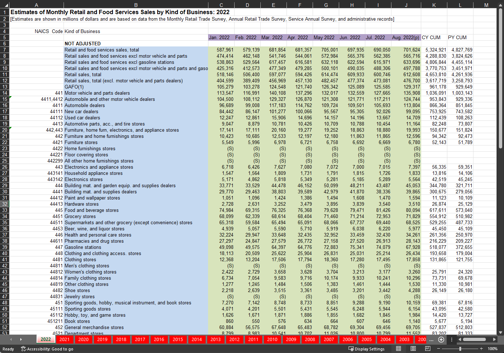

## ETL, Analysis, and Visualization

ETL (extract-transform-load) is a process by which raw data is taken from a source (extract), converted and cleaned (transform), and stored into a database or data structure (load).

### Extraction
An xlsx file is pulled directly from a US Census Bureau web page.
```python
# 1. define url path
url = "https://www.census.gov/retail/mrts/www/mrtssales92-present.xlsx"

# 2. download the data behind the URL
response = requests.get(url)

# 3. Open the response into a new file called mrtssales92-present.xlsx
open("mrtssales92-present.xlsx", "wb").write(response.content)
```

### Workbook and Spreadsheet layout

#### [Monthly Retail Trade Survey (MRTS) Data](https://www.census.gov/retail/index.html#mrts)

This data is often used in economics to observe and predict spending trends.

<p align="center">

</p>

* This is a time series so each numeric column represents sales figures recorded at a monthly interval. The headers for this dataset are highlighted in purple and will become the x-axis in line charts.
* In red, you can see that there is a tab for each year from 1992 to 2022 in descending order.
* Business categories are highlighted in blue.
* Sales figures are higlighted in green.

### Process Flow


This is the function used to load the pandas dataframe into the MYSQL database.
```python
# Define function using cursor.executemany() to insert the dataframe
def execute_many(conn, datafrm, table):
    
    # Creating a list of tuples from the dataframe values
    tpls = [tuple(x) for x in datafrm.to_numpy()]
    
    # Comma-separated columns
    cols = ','.join(list(datafrm.columns))
    
    # SQL query to execute
    sql = """INSERT INTO %s(%s) VALUES(%%s,%%s,%%s,%%s,%%s,%%s,%%s,
    %%s,%%s,%%s,%%s,%%s,%%s,%%s,%%s,%%s,%%s,%%s,%%s,%%s,%%s,%%s,%%s,
    %%s,%%s,%%s,%%s,%%s,%%s,%%s,%%s,%%s,%%s,%%s,%%s,%%s,%%s,%%s,%%s,
    %%s,%%s,%%s,%%s,%%s,%%s,%%s,%%s,%%s,%%s,%%s,%%s,%%s,%%s,%%s,%%s,
    %%s,%%s,%%s,%%s,%%s,%%s,%%s,%%s,%%s,%%s,%%s)""" % (table, cols)
    cursor = conn.cursor()
    try:
        cursor.executemany(sql, tpls)
        conn.commit()
        print("Data inserted using execute_many() successfully...")
    except mysql.connector.Error as err:
        print("Error while inserting to MySQL", err)
```

The data is now accessible from within the database and can be queried from Python and other clients.
```python
monthly_retail_actuals = pd.read_sql("""SELECT Month,
                                               Retail_and_food_services_sales_total  
                                        FROM Sales 
                                        WHERE Month >= '2017-01-01'""", con=cnx)

comparisons = pd.read_sql("""SELECT Month, 
                                    Book_stores, 
                                    Sporting_goods_stores, 
                                    Hobby_toy_and_game_stores 
                             FROM Sales 
                             WHERE Month >= '2017-01-01'""", con=cnx)
```
### Trend Analysis


Total sales for the retail and food services categories are trending upward year over year with seasonal downtimes.

### Industry Comparisons


Within this group, Sporting goods stores have the highest growth rate in sales.

### Percent Changes


Seasons are more noticeable when visualizing change rates over a span of years. Here we see Sporting goods stores peaking during the fourth quarter of each year and then diving at the beginning of each year.

### [Code](https://github.com/jlstewart12/Monthly_Retail_Trade_Report_ETL_Analysis/blob/main/src/ETL/ETL_Analysis_Visualization.ipynb)
